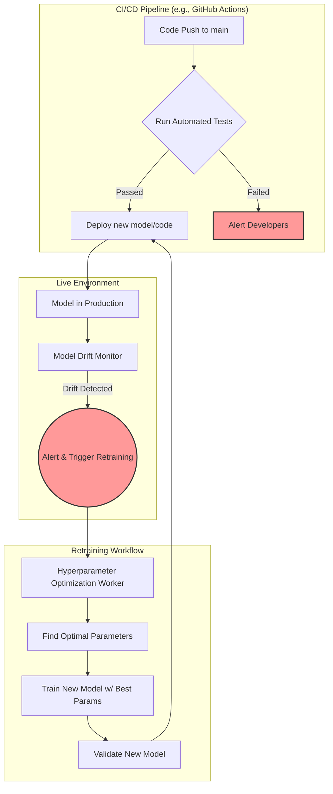

# Advanced Validation Systems: Implementation Plan
## Phase 2: Automated Testing, Drift Detection, and Hyperparameter Optimization

---

### **1. Overview & Objectives**

This document provides a granular implementation plan for Phase 2 of the Sensory Compass enhancement strategy. The goal is to build a robust, automated system for maintaining model accuracy and performance over time. This involves three core components:
1.  **Automated Testing Pipeline**: To ensure all new code and model updates are rigorously tested.
2.  **Model Drift Detection**: To monitor models in a conceptual "production" environment and alert when their performance degrades.
3.  **Hyperparameter Optimization**: To systematically find the best parameters for our models.

This plan is designed for parallel execution by a team of AI coding agents.

---

### **2. Architectural Diagram**

This diagram illustrates how the new components will interact a conceptual continuous-deployment workflow.

---

### **3. Phased Implementation & Parallel Task Breakdown**

Tasks are broken down to be assigned to individual AI coding agents. Tasks in the same "Parallel Group" can be worked on simultaneously.

#### **Parallel Group 1: Core Module Scaffolding (Weeks 5-6)**

| Task ID | Task Description | Dependencies | AI Agent Prompt |
| :--- | :--- | :--- | :--- |
| **AV-01** | Create the directory structure and placeholder files for the Automated Testing Pipeline. | None | `### CONTEXT
You are an expert AI coding assistant. We are building an 'Advanced Validation System'. All relevant code resides in the `/src` directory.

### OBJECTIVE
Create the necessary directory structure and empty placeholder files for the new automated testing pipeline.

### ACCEPTANCE CRITERIA
- A new directory must be created at `src/lib/testing`.
- Inside `src/lib/testing`, create the following empty files: `performanceTester.ts`, `biasTester.ts`, and `regressionTester.ts`.
- Add a single JSDoc comment at the top of each file explaining its future purpose (e.g., `/** @file For performance regression testing. */`).

### DOCUMENTATION & LOGGING
Update the `CHANGELOG.md` file at the project root. Append a new entry under the `### Added` section for the current feature version:
- `AV-01`: Scaffolded directory and files for the automated testing pipeline.` |
| **AV-02** | Scaffold the Model Drift Detection module with its core interfaces. | None | `### CONTEXT
You are an expert AI coding assistant. We are building an 'Advanced Validation System'. All relevant code resides in the `/src` directory.

### OBJECTIVE
Create a new file at `src/lib/monitoring/modelDrift.ts` and define the necessary interfaces and class structure for the Model Drift Detector. Do not implement logic yet.

### ACCEPTANCE CRITERIA
- The new file must be created at `src/lib/monitoring/modelDrift.ts`.
- The file must define and export a `DriftConfig` interface and a `DriftResult` interface.
- The file must define and export a `ModelDriftDetector` class with an empty public method: `detect(newData: tf.Tensor, referenceData: tf.Tensor): Promise<DriftResult>`.
- Add JSDoc comments to all interfaces, classes, and methods.

### DOCUMENTATION & LOGGING
Update the `CHANGELOG.md` file at the project root. Append a new entry under the `### Added` section for the current feature version:
- `AV-02`: Scaffolded the Model Drift Detection module, including interfaces and class structure.` |
| **AV-03**| Develop the Hyperparameter Optimization worker's basic structure. | None | `### CONTEXT
You are an expert AI coding assistant. We are building an 'Advanced Validation System'. All relevant code resides in the `/src` directory.

### OBJECTIVE
Create a new worker file at `src/workers/hyperparameterOptimization.worker.ts` to handle automated model tuning. Scaffold the basic message handling but do not implement the optimization logic itself.

### ACCEPTANCE CRITERIA
- The new file must be created at `src/workers/hyperparameterOptimization.worker.ts`.
- The worker must handle incoming messages and have a placeholder `switch` statement for different optimization strategies (e.g., 'gridSearch', 'bayesian').
- Define and export the `OptimizationRequest` and `OptimizationResult` types.
- Add JSDoc comments explaining the purpose of the worker and its message types.

### DOCUMENTATION & LOGGING
Update the `CHANGELOG.md` file at the project root. Append a new entry under the `### Added` section for the current feature version:
- `AV-03`: Scaffolded the Hyperparameter Optimization worker with message handling.` |

#### **Parallel Group 2: Logic Implementation & Integration (Weeks 7-8)**

| Task ID | Task Description | Dependencies | AI Agent Prompt |
| :--- | :--- | :--- | :--- |
| **AV-04** | Implement the Model Drift Detection logic using a statistical distance measure. | AV-02 | `### CONTEXT
You are an expert AI coding assistant. The `ModelDriftDetector` has been scaffolded in `src/lib/monitoring/modelDrift.ts`.

### OBJECTIVE
Implement the logic for the `detect` method in the `ModelDriftDetector` class. Use the Kullback-Leibler (KL) divergence to compare the distribution of new data against a reference dataset.

### ACCEPTANCE CRITERIA
- The logic must be implemented inside the `detect` method in `src/lib/monitoring/modelDrift.ts`.
- The method should calculate the probability distribution of both the `newData` and `referenceData` tensors.
- It must compute the KL divergence between the two distributions.
- The method will return a `DriftResult` object containing the divergence score and a boolean `isDriftDetected` based on a configurable threshold.
- The implementation must be well-documented with JSDoc comments.

### DOCUMENTATION & LOGGING
Update the `CHANGELOG.md` file at the project root. Append a new entry under the `### Added` section for the current feature version:
- `AV-04`: Implemented KL divergence logic for model drift detection.` |
| **AV-05**| Implement the Grid Search logic in the Hyperparameter Optimization worker. | AV-03 | `### CONTEXT
You are an expert AI coding assistant. The Hyperparameter Optimization worker has been scaffolded in `src/workers/hyperparameterOptimization.worker.ts`.

### OBJECTIVE
Implement the "Grid Search" strategy within the Hyperparameter Optimization worker. The function should accept a model creation function, a dataset, and a grid of parameters to test.

### ACCEPTANCE CRITERIA
- The logic must be implemented within the `onmessage` handler for the 'gridSearch' case.
- The worker must iterate through every combination of hyperparameters defined in the request.
- For each combination, it must use the `CrossValidator` (from `src/lib/validation/crossValidation.ts`) to train and evaluate a new model.
- The worker must track the performance for each combination and return the set of parameters that yielded the best average validation score.

### DOCUMENTATION & LOGGING
Update the `CHANGELOG.md` file at the project root. Append a new entry under the `### Added` section for the current feature version:
- `AV-05`: Implemented Grid Search functionality in the Hyperparameter Optimization worker.` |
| **AV-06**| Set up the CI/CD workflow configuration file for automated testing. | AV-01 | `### CONTEXT
You are an expert AI coding assistant. The placeholder files for testing have been created.

### OBJECTIVE
Create a GitHub Actions workflow file at `.github/workflows/validation.yml` that will trigger on every push to the `main` branch.

### ACCEPTANCE CRITERIA
- A new file `.github/workflows/validation.yml` must be created.
- The workflow should define jobs to: 1. Install dependencies (`npm install`). 2. Run linter (`npm run lint`). 3. Run unit tests (`npm test`).
- Placeholder steps for running the new performance and bias tests (`npm run test:performance`, `npm run test:bias`) should be added but can be commented out.
- The workflow must be syntactically correct YAML.

### DOCUMENTATION & LOGGING
Update the `CHANGELOG.md` file at the project root. Append a new entry under the `### Added` section for the current feature version:
- `AV-06`: Created GitHub Actions workflow for CI/CD automated validation.` |