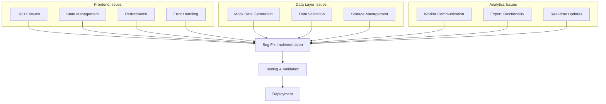
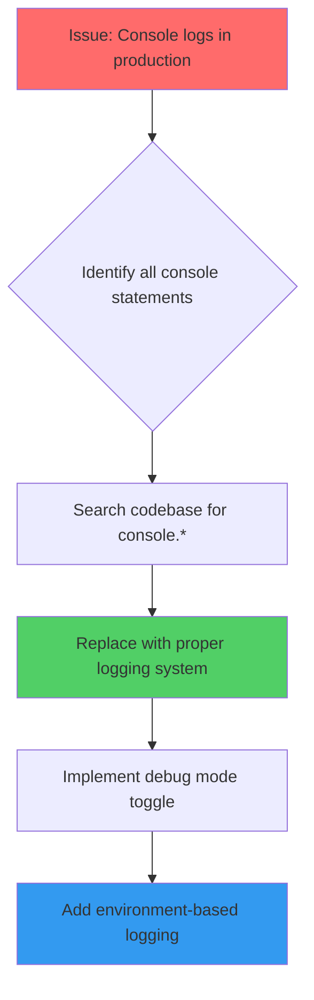
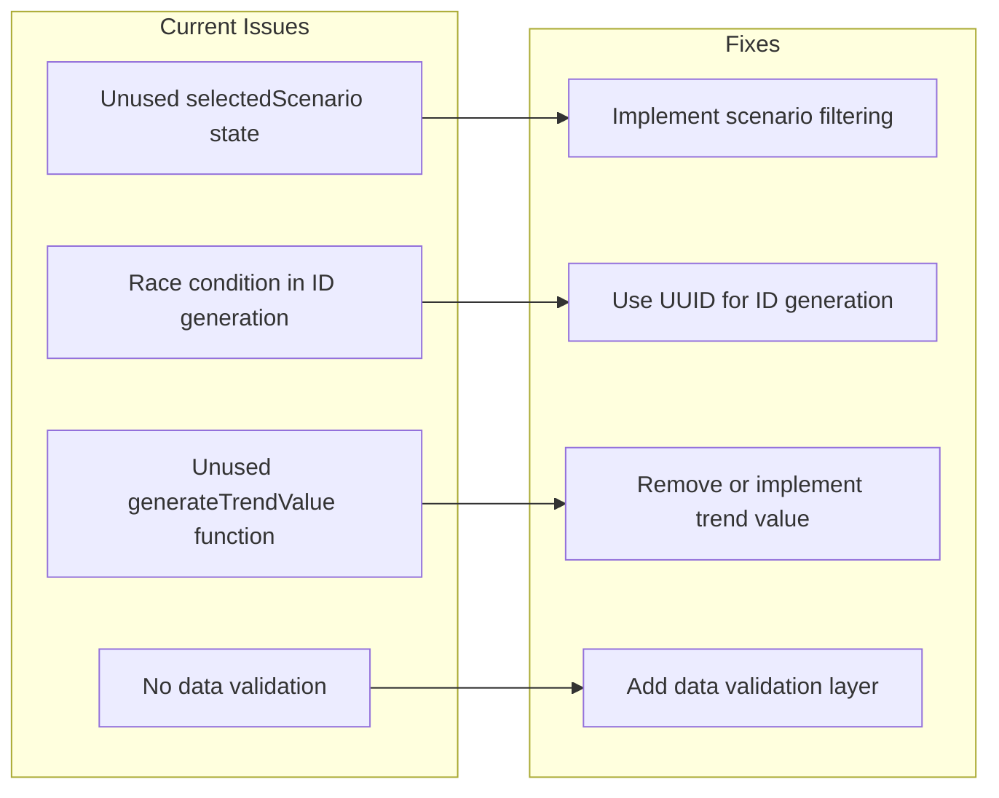
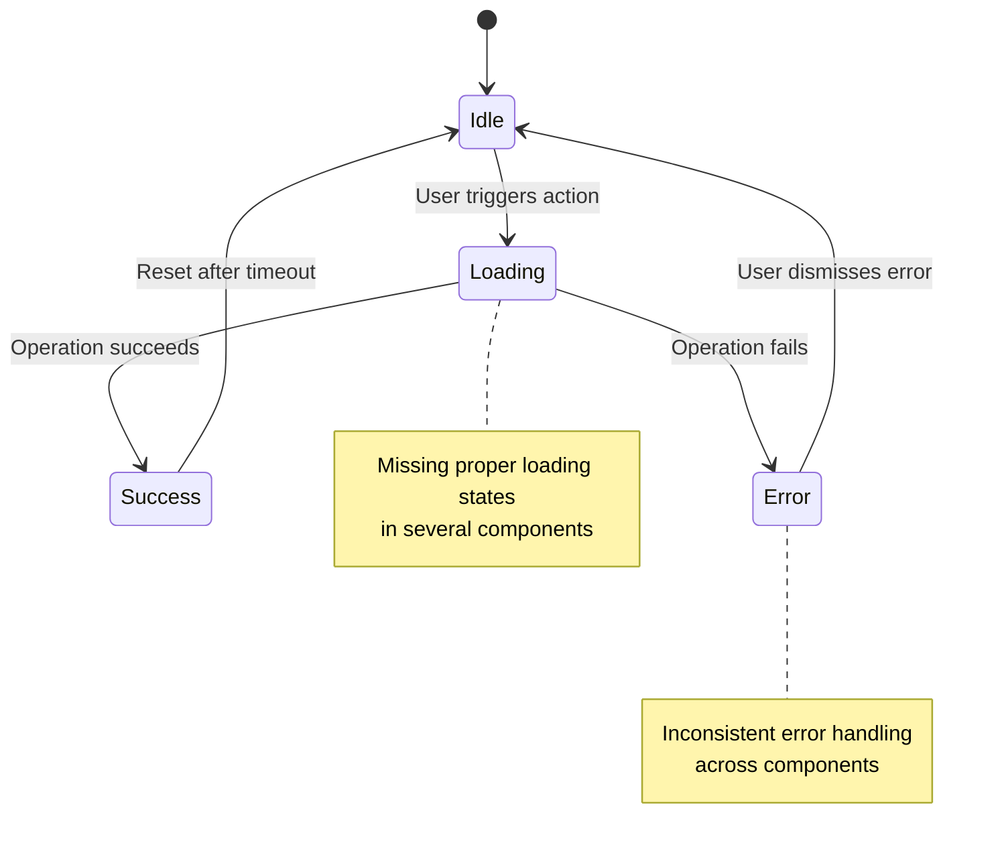
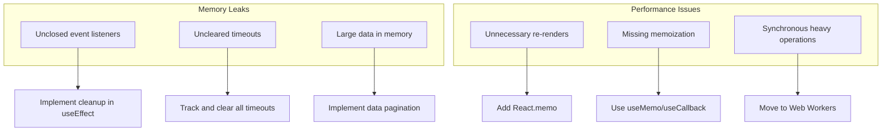
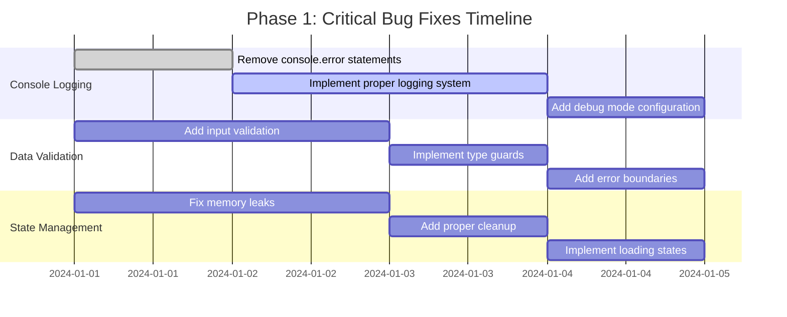
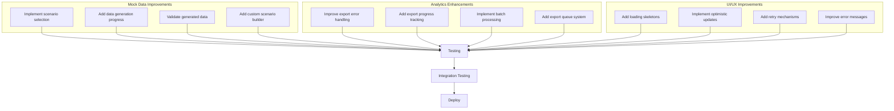
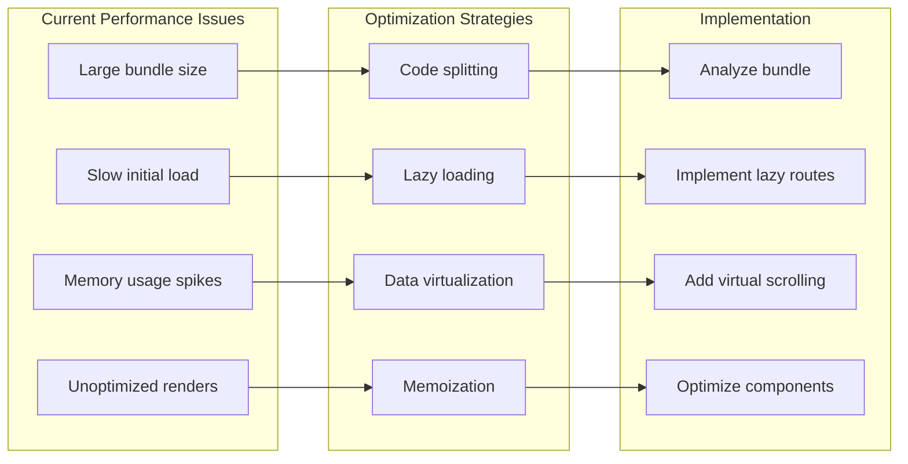
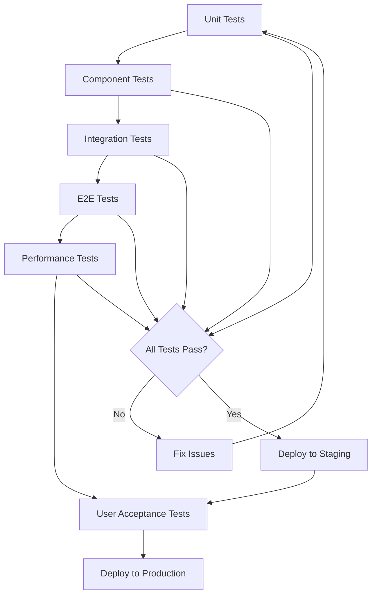
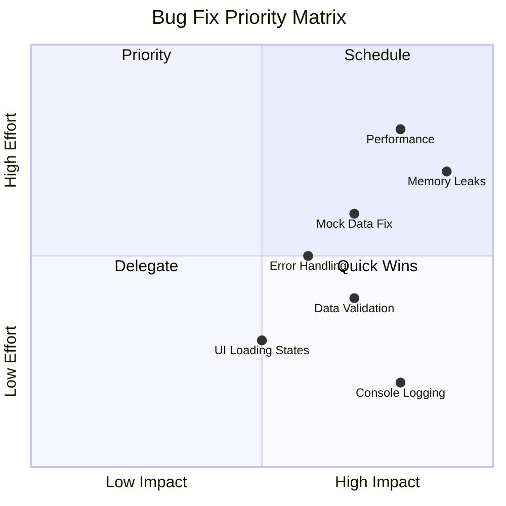

# Bug Fix and Improvement Plan for Sensory Compass Application

## Overview
This document outlines identified bugs, issues, and improvements needed in the Sensory Compass application, organized as a step-by-step plan with tasks and subtasks.

## High-Level Architecture Overview

## Identified Issues and Fix Plan

### 1. Console Logging in Production Code

**Files affected:**
- `src/components/AnalyticsDashboard.tsx` (line 137)
- `src/lib/mockDataGenerator.ts` (lines 324, 345)

### 2. Mock Data Generator Issues

### 3. Component State Management Issues

### 4. Performance and Memory Issues

## Detailed Task Breakdown

### Phase 1: Critical Bug Fixes (Priority: High)

### Phase 2: Feature Improvements (Priority: Medium)

### Phase 3: Performance Optimization (Priority: Medium)

## Implementation Tasks

### Task 1: Remove Console Statements and Implement Logging System

**Subtasks:**
1. Search and remove all console.* statements
2. Create a centralized logging service
3. Implement environment-based logging levels
4. Add debug mode toggle in settings

**Files to modify:**
- Create `src/lib/logger.ts`
- Update `src/components/AnalyticsDashboard.tsx`
- Update `src/lib/mockDataGenerator.ts`
- Add logging configuration to environment variables

### Task 2: Fix Mock Data Generator

**Subtasks:**
1. Implement scenario filtering logic
2. Replace Date.now() with UUID library for ID generation
3. Remove or implement the unused generateTrendValue function
4. Add data validation before storage
5. Implement progressive data generation for better performance

**Files to modify:**
- `src/components/MockDataLoader.tsx`
- `src/lib/mockDataGenerator.ts`
- Create `src/lib/dataValidation.ts` (enhance existing)

### Task 3: Fix State Management and Memory Leaks

**Subtasks:**
1. Audit all useEffect hooks for proper cleanup
2. Implement proper error boundaries
3. Add loading states to all async operations
4. Fix the showSettings dialog memory leak in AnalyticsDashboard

**Files to modify:**
- `src/components/AnalyticsDashboard.tsx`
- `src/components/ErrorBoundary.tsx` (enhance)
- Create `src/hooks/useAsyncState.ts`

### Task 4: Improve Error Handling

**Subtasks:**
1. Create standardized error types
2. Implement global error handler
3. Add user-friendly error messages
4. Implement retry mechanisms for failed operations

**Files to create/modify:**
- Create `src/types/errors.ts`
- Create `src/lib/errorHandler.ts`
- Update all try-catch blocks to use standardized handling

### Task 5: Performance Optimizations

**Subtasks:**
1. Implement React.memo for heavy components
2. Add useMemo/useCallback where appropriate
3. Implement virtual scrolling for large lists
4. Add lazy loading for routes and components
5. Optimize bundle size with code splitting

**Files to modify:**
- All component files (selective memoization)
- `src/App.tsx` (route lazy loading)
- `vite.config.ts` (bundle optimization)

## Testing Plan

## Priority Matrix

## Success Metrics

1. **Performance Metrics:**
   - Initial load time < 3 seconds
   - Time to interactive < 5 seconds
   - Memory usage stable (no leaks)
   - Bundle size < 500KB

2. **Quality Metrics:**
   - Zero console errors in production
   - All async operations have proper error handling
   - 100% of components have loading states
   - No memory leaks detected

3. **User Experience Metrics:**
   - Error messages are user-friendly
   - All operations provide feedback
   - No UI freezes during heavy operations
   - Smooth animations and transitions

## Conclusion

This plan addresses the major bugs and issues identified in the Sensory Compass application. By following this structured approach, we can systematically improve the application's reliability, performance, and user experience.