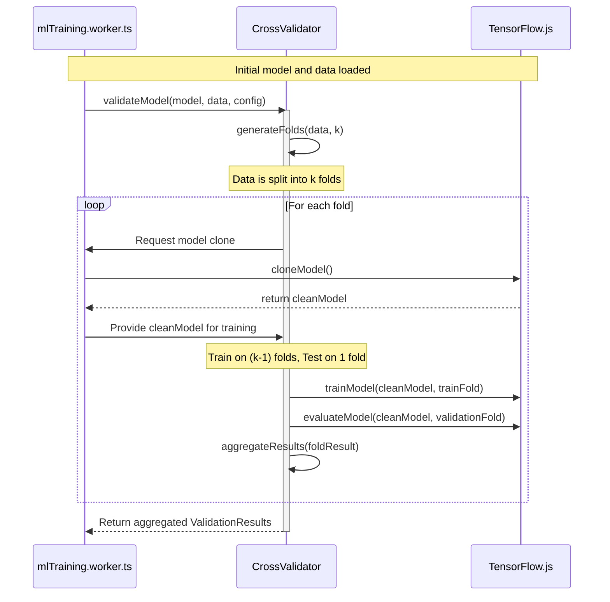

# Parallel Implementation Plan
## Feature: Cross-Validation Framework

---

### **1. Overview & Objectives**

This document outlines the granular, parallel implementation plan for the **Cross-Validation Framework**, which is the first and most critical feature from the `SENSORY_COMPASS_ENHANCEMENT_STRATEGY.md`. The objective is to replace the current simple train/validation split in the ML training worker with a robust K-Fold Cross-Validation system. This will provide a more accurate assessment of model performance and is the first step towards achieving 2025 Educational AI Standards compliance. This plan is designed for execution by AI coding agents.

---

### **2. Architectural Diagram**

This diagram illustrates the sequence of operations for the new cross-validation process. The `mlTraining.worker.ts` will orchestrate the process, delegating the core folding and validation logic to the new `CrossValidator` module.

---

### **3. Prerequisites & Assumptions**

*   **Prerequisites:**
    *   The project utilizes TensorFlow.js (`@tensorflow/tfjs`) for machine learning models.
    *   The development environment is TypeScript-based, configured via `tsconfig.json`.
    *   The primary ML training logic resides in `src/workers/mlTraining.worker.ts`.
    *   An AI coding agent with file system access will execute all tasks.

*   **Assumptions:**
    *   A `TrainingData` type or interface is well-defined and includes features and labels.
    *   The ML models to be validated are `tf.Sequential` instances.
    *   The dataset is suitable for stratified sampling based on an accessible `label` field.
    *   Engineering team has access to the `SENSORY_COMPASS_ENHANCEMENT_STRATEGY.md` for broader context.

---

### **4. Common Pitfalls & Mitigation**

1.  **Data Leakage During Preprocessing:**
    *   **Pitfall:** Applying data-fitting operations (e.g., `MinMaxScaler.fit_transform`) to the entire dataset before splitting it into folds can leak information from the validation sets into the training sets, leading to optimistically biased performance metrics.
    *   **Mitigation:** All data-fitting transformations MUST be performed independently *inside* the cross-validation loop. Fit the scaler on the training fold only, then use it to transform both the training and validation folds.

2.  **Inconsistent Model State Across Folds:**
    *   **Pitfall:** Reusing the same model object across multiple folds without re-initializing its weights will cause the model to accumulate learning, invalidating the independence of each fold's evaluation.
    *   **Mitigation:** For each fold, a fresh, untrained instance of the model architecture must be created and trained. The recommended approach is to define the model architecture once and create a new instance from that definition at the start of each loop iteration.

3.  **Incorrect Stratification Logic:**
    *   **Pitfall:** Failing to maintain the original class distribution in each fold, especially with imbalanced datasets, can lead to folds with no instances of a particular class, resulting in skewed and unreliable validation metrics.
    *   **Mitigation:** The `generateFolds` logic must group data indices by their class label first, then distribute these indices proportionally across the `k` folds to ensure each fold is a representative sample of the overall dataset.

---

### **5. Phased Implementation & Task Breakdown**

The implementation is broken into two main phases. Tasks within the same phase that share no dependencies can be executed in parallel by different AI agents.

#### **Phase 1: Core Module Creation (Parallel Execution)**

| Task ID | Task Description | Dependencies | AI Agent Prompt |
| :--- | :--- | :--- | :--- |
| **CV-01** | Create the `crossValidation.ts` file and define all necessary TypeScript interfaces for the module. | None | `### CONTEXT
You are an expert AI coding assistant. The project is a TypeScript/React web application using TensorFlow.js. We are adding the 'Cross-Validation Framework' functionality. Your current task is critical for this feature. All relevant code resides in the `/src` directory.

### OBJECTIVE
Create a new file at `src/lib/validation/crossValidation.ts`. In this file, define and export all necessary TypeScript interfaces as specified in the `SENSORY_COMPASS_ENHANCEMENT_STRATEGY.md` document.

### ACCEPTANCE CRITERIA
- The new file must be created at `src/lib/validation/crossValidation.ts`.
- The file must contain and export the following interfaces: `CrossValidationConfig`, `ValidationMetrics`, `TrainingFold`, and `ValidationResults`.
- Interface properties must strictly match those defined in the strategy document (e.g., `CrossValidationConfig` must have `folds`, `stratified`, etc.).
- Add JSDoc comments to each interface and property explaining its purpose.

### DOCUMENTATION & LOGGING
Upon successful implementation and verification, you MUST create a `CHANGELOG.md` file at the project root if it does not exist. Append a new entry under the `### Added` section. The entry must follow this exact format:
- `CV-01`: Created `crossValidation.ts` and defined core interfaces for the validation framework.` |
| **CV-02** | Scaffold the `CrossValidator` class structure within the new `crossValidation.ts` file. | CV-01 | `### CONTEXT
You are an expert AI coding assistant. The project is a TypeScript/React web application. We are adding the 'Cross-Validation Framework' functionality. The core interfaces for this feature have been defined in `src/lib/validation/crossValidation.ts`.

### OBJECTIVE
In the existing file `src/lib/validation/crossValidation.ts`, define and export the `CrossValidator` class structure with placeholder methods. Do not implement the logic yet.

### ACCEPTANCE CRITERIA
- The `CrossValidator` class must be created within `src/lib/validation/crossValidation.ts`.
- The class must contain the following public methods with correct type annotations but empty bodies: `validateModel`, `generateFolds`, and `calculateValidationMetrics`.
- Method signatures must match the specifications, for example: `generateFolds(data: TrainingData, k: number): TrainingFold[]`.
- Add JSDoc comments to the class and each method explaining its purpose.

### DOCUMENTATION & LOGGING
Upon successful implementation and verification, you MUST update the `CHANGELOG.md` file at the project root. Append a new entry under the `### Added` section. The entry must follow this exact format:
- `CV-02`: Scaffolded the `CrossValidator` class structure with placeholder methods.` |

#### **Phase 2: Logic Implementation and Integration (Sequential Execution)**

| Task ID | Task Description | Dependencies | AI Agent Prompt |
| :--- | :--- | :--- | :--- |
| **CV-03** | Implement the data splitting and stratification logic in the `generateFolds` method. | CV-02 | `### CONTEXT
You are an expert AI coding assistant. The project is a TypeScript/React web application. The `CrossValidator` class has been scaffolded in `src/lib/validation/crossValidation.ts`.

### OBJECTIVE
Implement the complete logic for the `generateFolds` method within the `CrossValidator` class. This method should handle splitting data into k-folds and support stratification.

### ACCEPTANCE CRITERIA
- The logic must be implemented inside the `generateFolds` method in `src/lib/validation/crossValidation.ts`.
- The method must correctly partition the dataset's indices into `k` folds.
- If stratification is enabled via the config, the method must ensure that the class distribution in each fold is proportional to the overall dataset's distribution.
- The method must return an array of `TrainingFold` objects.
- The implementation must be efficient and well-documented with JSDoc comments explaining the logic.

### DOCUMENTATION & LOGGING
Upon successful implementation and verification, you MUST update the `CHANGELOG.md` file at the project root. Append a new entry under the `### Added` section. The entry must follow this exact format:
- `CV-03`: Implemented stratified k-fold data splitting logic in `CrossValidator`.` |
| **CV-04** | Implement the core model training and validation loop within the `validateModel` method. | CV-03 | `### CONTEXT
You are an expert AI coding assistant. The `CrossValidator` class in `src/lib/validation/crossValidation.ts` now has a functional `generateFolds` method.

### OBJECTIVE
Implement the complete logic for the `validateModel` method in the `CrossValidator` class. This method will orchestrate the k-fold cross-validation process.

### ACCEPTANCE CRITERIA
- The logic must be implemented inside the `validateModel` method in `src/lib/validation/crossValidation.ts`.
- The method must call `generateFolds` to get the data splits.
- It must loop through each fold, treating one fold as the validation set and the rest as the training set.
- **Crucially**, inside the loop, it must create a new, untrained instance of the model for each fold to prevent data leakage.
- After training and evaluating on each fold, it should aggregate the results and return a `ValidationResults` object.

### DOCUMENTATION & LOGGING
Upon successful implementation and verification, you MUST update the `CHANGELOG.md` file at the project root. Append a new entry under the `### Added` section. The entry must follow this exact format:
- `CV-04`: Implemented the main k-fold training and validation loop in `CrossValidator`.` |
| **CV-05** | Integrate the `CrossValidator` class into the `mlTraining.worker.ts` file. | CV-04 | `### CONTEXT
You are an expert AI coding assistant. The `CrossValidator` module in `src/lib/validation/crossValidation.ts` is now fully functional.

### OBJECTIVE
Refactor the training logic in `src/workers/mlTraining.worker.ts` to use the new `CrossValidator` module, replacing the old simple validation split.

### ACCEPTANCE CRITERIA
- `src/workers/mlTraining.worker.ts` must be modified to import `CrossValidator`.
- The existing logic for splitting data using `validation_split` (around lines 146-152 in the original file) must be removed.
- An instance of `CrossValidator` must be created and its `validateModel` method must be called to run the training and validation process.
- The results from the cross-validation must be correctly handled and reported back from the worker.

### DOCUMENTATION & LOGGING
Upon successful implementation and verification, you MUST update the `CHANGELOG.md` file at the project root. Append a new entry under the `### Added` section. The entry must follow this exact format:
- `CV-05`: Integrated the `CrossValidator` module into `mlTraining.worker.ts`, replacing the previous validation method.` |