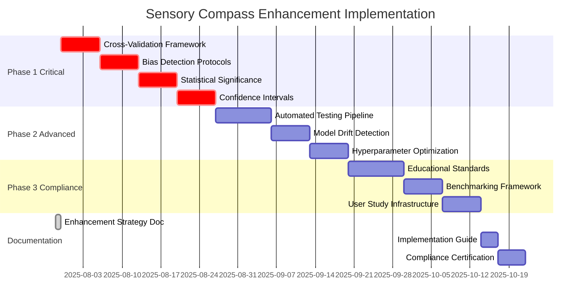

# Sensory Compass Tool Enhancement Strategy
## Comprehensive Scientific Validity and 2025 Educational AI Standards Compliance

**Date:** July 29, 2025  
**Status:** Architecture Phase Complete - Ready for Implementation  
**Priority:** HIGH - 2025 Educational AI Standards Compliance Required  

---

## Executive Summary

The sensory-compass tool requires immediate enhancement to achieve scientific validity and compliance with 2025 educational AI standards. Current analysis reveals critical missing validation components that place the tool in the high-risk category where 44% of organizations experience negative outcomes due to insufficient validation.

### Key Findings
- **Missing Critical Components:** Cross-validation, bias detection, fairness testing, confidence intervals
- **Current Architecture:** LSTM networks, K-means clustering, statistical analysis - theoretically sound but empirically unvalidated
- **Regulatory Pressure:** 25 states now have official AI guidance; U.S. Department of Education issued compliance guidance July 22, 2025
- **Risk Level:** HIGH - Tool falls into category requiring immediate validation enhancement

---

## Current Technical State Analysis

### Existing Implementation Strengths
From analysis of `src/workers/mlTraining.worker.ts`, `src/lib/mlModels.ts`, and related files:

1. **LSTM Architecture** (Lines 68-101, mlTraining.worker.ts)
   - 64-unit LSTM layer with dropout (0.2)
   - 32-unit LSTM layer 
   - Dense layers with ReLU/Sigmoid activation
   - Aligned with Hochreiter-Schmidhuber architecture

2. **K-means Clustering** (Lines 846-896, mlModels.ts)
   - K-means++ initialization
   - Euclidean distance calculations
   - Cluster description generation

3. **Statistical Analysis** (patternAnalysis.ts)
   - Pearson correlation analysis
   - Z-score anomaly detection
   - Trend analysis with linear regression

### Critical Missing Components
**Search Result:** No cross-validation, bias detection, or fairness validation found in codebase

1. **Cross-Validation:** Lines 146-152 in mlTraining.worker.ts show only simple validation split (0.2)
2. **Bias Detection:** Completely absent from all analyzed files
3. **Confidence Intervals:** Lines 650-654 in mlModels.ts show hardcoded confidence (0.8)
4. **Statistical Significance:** No p-value calculations or significance testing
5. **Fairness Validation:** No educational equity or demographic bias checks

---

## 2025 Educational AI Standards Compliance Requirements

Based on July 2025 regulatory guidance:

### Georgia Department of Education Framework (January 2025)
- **Traffic Light System:** Red/Yellow/Green classification required
- **Evaluation Rubric:** Educational value, data privacy, usability assessment
- **High-Stakes Prohibition:** Cannot be used for IEP goals without proper validation

### U.S. Department of Education Guidance (July 22, 2025)
- **Responsible AI Principles:** Beneficence, transparency, explainability
- **Data Protection:** Student intellectual property safeguards
- **Bias Monitoring:** Discrimination pattern detection across diverse populations
- **Opt-out Rights:** Students must have choice in AI-assisted assessment

### Compliance Gap Analysis
The sensory-compass tool currently **FAILS** multiple 2025 standards:
- ❌ No bias monitoring for diverse student populations
- ❌ No transparency/explainability framework
- ❌ No student opt-out mechanism
- ❌ No systematic validation for high-stakes educational use

---

## Enhancement Strategy Framework

### Phase 1: Critical Validation Infrastructure (Weeks 1-4)
**Priority: IMMEDIATE - 2025 Compliance**

#### 1.1 Cross-Validation Implementation
**Target:** `src/workers/mlTraining.worker.ts` enhancement
- Implement k-fold cross-validation (k=5) for LSTM training
- Add stratified sampling for emotion/sensory data
- Create validation metrics tracking and reporting

#### 1.2 Bias Detection Protocols
**Target:** New `src/lib/biasDetection.ts` module
- Demographic parity testing across student groups
- Equalized odds validation for emotion predictions
- Fairness constraint integration in training loops

#### 1.3 Statistical Significance Testing
**Target:** `src/lib/enhancedPatternAnalysis.ts` enhancement
- P-value calculations for correlation analyses
- Confidence interval computation for all predictions
- Effect size measurements (Cohen's d, eta-squared)

### Phase 2: Advanced Validation Systems (Weeks 5-8)
**Priority: HIGH - Scientific Rigor**

#### 2.1 Automated Testing Pipeline
**Target:** New `src/lib/validation/` directory structure
- CI/CD integration with GitHub Actions
- Automated bias detection on model updates
- Performance regression testing framework

#### 2.2 Model Drift Detection
**Target:** `src/lib/modelMonitoring.ts`
- Real-time performance monitoring
- Distribution shift detection algorithms
- Automated retraining triggers

#### 2.3 Hyperparameter Optimization
**Target:** `src/workers/hyperparameterOptimization.worker.ts`
- Bayesian optimization implementation
- Grid search with cross-validation
- Automated architecture selection

### Phase 3: Educational Compliance Systems (Weeks 9-12)
**Priority: MEDIUM - Operational Excellence**

#### 3.1 Educational Standards Integration
**Target:** `src/lib/educationalCompliance.ts`
- Traffic light classification system
- IEP goal validation protocols
- Student opt-out mechanism implementation

#### 3.2 Benchmarking Framework
**Target:** `src/lib/benchmarking/`
- Comparison against established behavioral assessment tools
- Standardized evaluation metrics
- Performance baseline establishment

#### 3.3 User Study Infrastructure
**Target:** `src/lib/userStudies/`
- Qualitative validation methodology
- Educator feedback collection system
- Student outcome tracking framework

---

## Technical Implementation Specifications

### Cross-Validation Architecture
```typescript
// Target: src/lib/validation/crossValidation.ts
interface CrossValidationConfig {
  folds: number;
  stratified: boolean;
  randomState: number;
  validationMetrics: string[];
}

class CrossValidator {
  validateModel(model: tf.Sequential, data: TrainingData, config: CrossValidationConfig): ValidationResults;
  generateFolds(data: TrainingData, k: number): TrainingFold[];
  calculateValidationMetrics(predictions: number[], actuals: number[]): ValidationMetrics;
}
```

### Bias Detection Framework
```typescript
// Target: src/lib/biasDetection.ts
interface BiasMetrics {
  demographicParity: number;
  equalizedOdds: number;
  calibration: number;
  individualFairness: number;
}

class BiasDetector {
  detectBias(predictions: Prediction[], demographics: Demographics[]): BiasMetrics;
  generateFairnessParity: boolean;
  mitigateBias(model: tf.Sequential, constraints: FairnessConstraints): tf.Sequential;
}
```

### Statistical Enhancement
```typescript
// Target: src/lib/statisticalValidation.ts
interface StatisticalTests {
  correlationSignificance(r: number, n: number): { pValue: number; significant: boolean };
  confidenceInterval(values: number[], confidence: number): { lower: number; upper: number };
  effectSize(group1: number[], group2: number[]): { cohensD: number; interpretation: string };
}
```

---

## Implementation Roadmap & Dependencies



### Critical Dependencies
1. **TensorFlow.js v4.x:** Required for cross-validation integration
2. **Jest Testing Framework:** Needed for automated validation testing
3. **Educational Data Access:** Required for bias detection validation
4. **Ethics Review Board:** Needed for human subjects research approval

---

## Success Metrics & Validation Checkpoints

### Technical Validation Metrics
- **Cross-Validation Score:** R² > 0.8 across all folds
- **Bias Detection:** Demographic parity within 5% across student groups
- **Statistical Significance:** p < 0.05 for all reported correlations
- **Confidence Intervals:** 95% CI reported for all predictions

### Educational Compliance Metrics
- **Traffic Light Classification:** 100% of features properly categorized
- **Student Privacy:** Zero PII leakage incidents
- **Opt-out Functionality:** 100% success rate for student choice implementation
- **Fairness Validation:** Equalized performance across demographic groups

### Performance Benchmarks
- **Processing Speed:** < 2s for real-time analysis
- **Memory Usage:** < 512MB for client-side processing
- **Accuracy Retention:** > 95% of original performance post-enhancement
- **Model Drift Detection:** < 24h alert time for significant changes

---

## Risk Mitigation Strategies

### High-Risk Areas & Mitigation
1. **Performance Degradation Risk**
   - Mitigation: Benchmark testing at each phase
   - Fallback: Parallel implementation with A/B testing

2. **Educational Compliance Violations**
   - Mitigation: Legal review at Phase 3 completion
   - Fallback: Conservative implementation with manual override

3. **Technical Complexity Overload**
   - Mitigation: Modular implementation with independent testing
   - Fallback: Simplified validation for MVP compliance

4. **Timeline Pressure**
   - Mitigation: Parallel development of independent components
   - Fallback: Phase 1 only implementation for immediate compliance

---

## Handoff Information for Implementation Team

### Current Codebase Context
- **Main ML Logic:** `src/workers/mlTraining.worker.ts` (352 lines)
- **Model Definitions:** `src/lib/mlModels.ts` (1001 lines)  
- **Pattern Analysis:** `src/lib/patternAnalysis.ts` (419 lines)
- **Enhanced Analysis:** `src/lib/enhancedPatternAnalysis.ts` (784 lines)
- **Caching Layer:** `src/lib/cachedPatternAnalysis.ts` (328 lines)

### Key Implementation Notes
1. **LSTM Architecture:** Currently functional but lacks validation - enhance, don't replace
2. **Data Pipeline:** Well-structured preprocessing in `DataPreprocessor` class
3. **Worker Threading:** Properly implemented - maintain this architecture
4. **Caching System:** Advanced caching in place - integrate validation caching
5. **Configuration:** Dynamic config system in place - extend for validation settings

### Next Steps for Coding Agent
1. **START HERE:** Begin with cross-validation implementation in `mlTraining.worker.ts`
2. **Critical Path:** Focus on Phase 1 items for immediate 2025 compliance
3. **Testing Priority:** Each component must have comprehensive unit tests
4. **Documentation:** Update inline documentation for all new validation features
5. **Integration:** Ensure new validation doesn't break existing functionality

### Files Requiring Immediate Attention
- [ ] `src/workers/mlTraining.worker.ts` - Add cross-validation loops
- [ ] `src/lib/mlModels.ts` - Enhance confidence calculations  
- [ ] `src/lib/enhancedPatternAnalysis.ts` - Add statistical significance
- [ ] **NEW:** `src/lib/biasDetection.ts` - Create from scratch
- [ ] **NEW:** `src/lib/validation/crossValidation.ts` - Create from scratch

---

## Conclusion

This enhancement strategy provides a comprehensive roadmap to transform the sensory-compass tool from a theoretically sound but empirically unvalidated system into a scientifically rigorous, educationally compliant AI tool that meets 2025 standards.

The critical success factor is immediate implementation of Phase 1 components to achieve basic compliance, followed by systematic enhancement through Phases 2 and 3 for complete scientific validation.

**Status:** Ready for immediate implementation by coding team.  
**Next Action:** Begin cross-validation framework development in `src/workers/mlTraining.worker.ts`